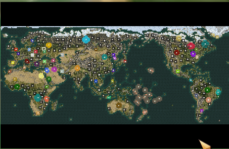

# Civ4 RI Map World of 2022
The following map is a modified version of the World map huge in Civ4 RI. The purpose is to create a world that is a little bit more similar to the current conflicts and alliances of 2022.
The map does not have the claim to be historic, but to provide a game, where already 4000 B.C. the present conflics are built in. 

## Modifications to the standrad world map
- Argentinians are replaced by the Dutch
- Palestinians are replaced by the Nubians
- North Korea is replaced by the South Chinese
- The north passage is open to travel with costal ships
- America can be reached with costal ships
- All main civilizations have already received their religions of 2022, to make alliances between e.g. euopean countries easier

## Images

The world map

Conflict Isreal and Palestine

Conflict North and South Korea

Conflict Russia and Ukraine

